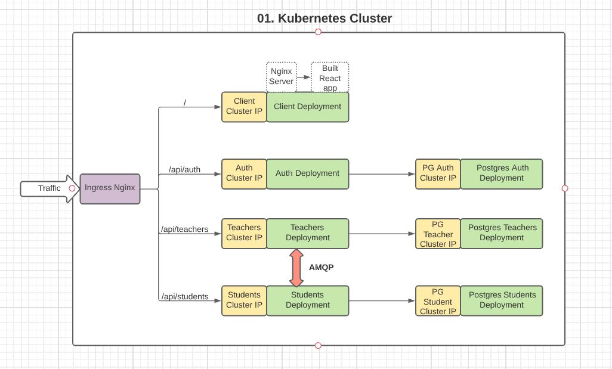
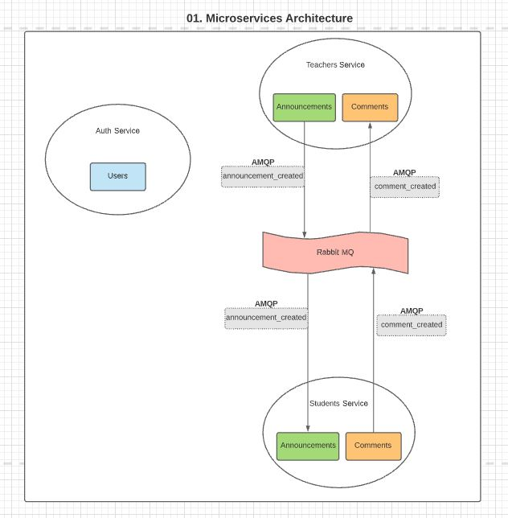
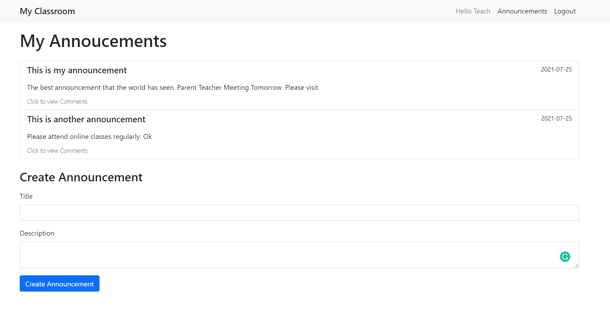
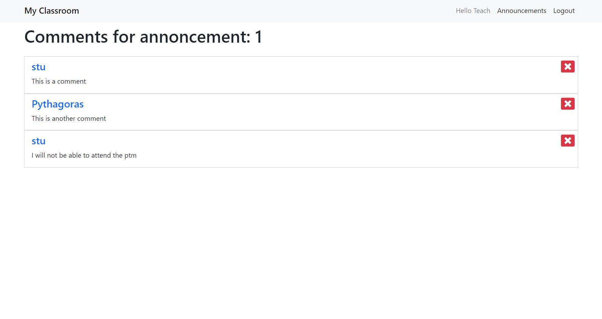
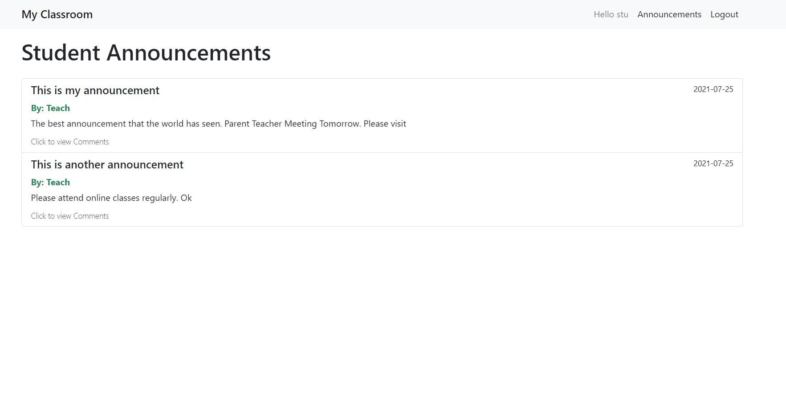
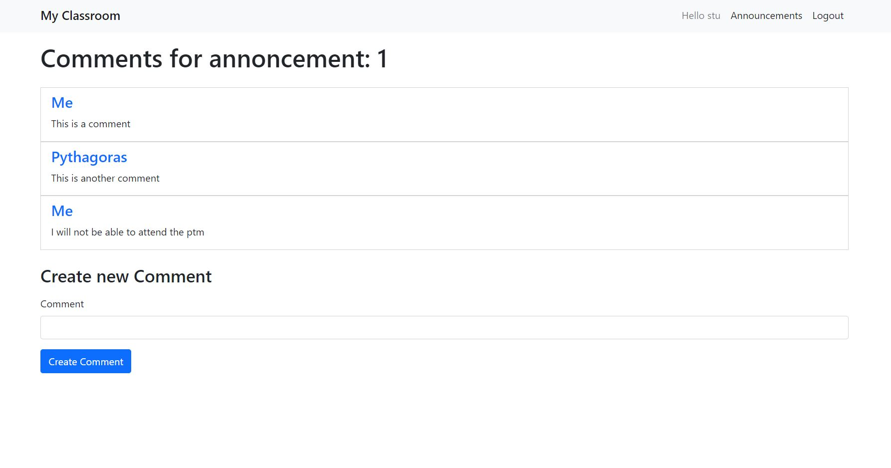
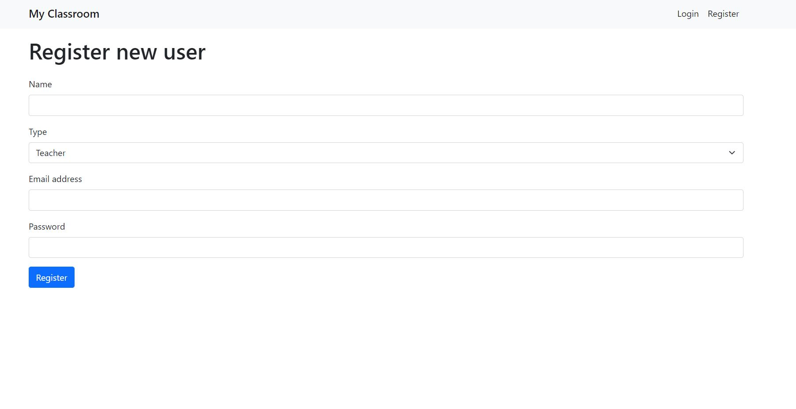
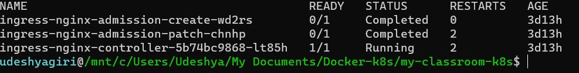
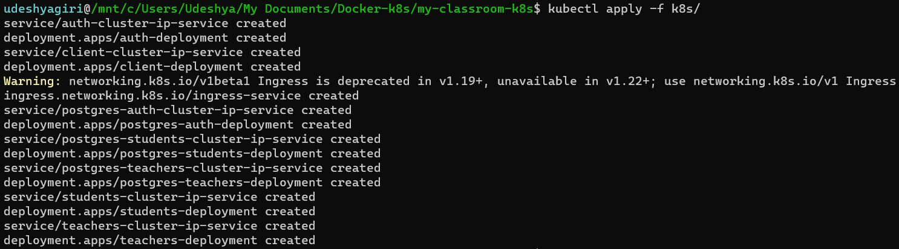

# My Microservices Project [](https://www.travis-ci.com/udeshyaG/microservices-classroom-app)

### [Click Here](https://lucid.app/lucidchart/invitations/accept/inv_f0ee79fc-296e-4ed6-b33d-ff46a0e353ad) to view the Architecture Diagrams

### Tech Used

- Kubernetes 🕸 (Container Orchestration)
- Docker 🐳 (Containerization)
- Node, Express JS (Backend)
- React ⚛ (Frontend)
- Postgres 🐘 (Database)
- Travis CI (Testing and Continuous Integration) 👷‍♂️

---

### Kubernetes Cluster


### Explanation
<table>
    <tbody>
    <tr>
      <th>Service</th>
      <th>Tech Used</th>
      <th>Description</th>
    </tr>
    <tr>
      <td>Client</td>
      <td>
        <ul>
          <li>React JS</li>
          <li>Nginx Server</li>
        </ul>
      </td>
      <td>
        <ul>
          <li>This is the front end of the app</li>
          <li>The client container has <strong>Nginx</strong> installed with the built react code</li>
          <li>Nginx serves the built react app from <code>build</code> folder</li>
        </ul>
      </td>
    </tr>
    <tr>
      <td>Auth</td>
      <td>
        <ul>
          <li>Node JS</li>
          <li>Postgres SQL</li>
        </ul>
      </td>
      <td>
        <ul>
          <li>Handles request to <code>/api/auth</code></li>
          <li>Registration and Login of Users</li>
          <li>Check if user is student or teacher</li>
        </ul>
      </td>
    </tr>
    <tr>
      <td>Teachers</td>
      <td>
        <ul>
          <li>Node JS</li>
          <li>Postgres SQL</li>
        </ul>
      </td>
      <td>
        <ul>
          <li><code>/api/teachers</code> Handles all functionality of teachers</li>
          <li>Has separate DB. Hence independent of all services</li>
          <li>Communicates with Students service using <strong>AMQP</strong>(Asynchronous Messaging Queue Protocol)</li>
        </ul>
      </td>
    </tr>
    <tr>
      <td>Students</td>
      <td>
        <ul>
          <li>Node JS</li>
          <li>Postgres SQL</li>
        </ul>
      </td>
      <td>
        <ul>
          <li><code>/api/students</code> Handles all functionality of students</li>
          <li>Has separate DB. Hence independent of all services</li>
          <li>Communicates with Teachers service using <strong>AMQP</strong></li>
        </ul>
      </td>
    </tr>
    <tr>
      <td>Ingress Nginx</td>
      <td>
        <ul>
          <li>Ingress Nginx Controller</li>
        </ul>
      </td>
      <td>
        <ul>
          <li>Gateway between the outside traffic and our Kubernetes cluster</li>
          <li>Routes traffic to appropriate service</li>
        </ul>
      </td>
    </tr>
  </tbody>
</table>

---

### Microservices Architecture


### Explanation
<table>
  <tbody>
    <tr>
      <th>Event</th>
      <th>Description</th>
    </tr>
    <tr>
      <td>Annoucement</td>
      <td>
        <ul>
          <li>Teacher Creates an announcement. Stores in Teachers DB</li>
          <li><code>announcement_created</code> event is created. Passed to <strong>RabbitMQ</strong> via <strong>AMQP</strong></li>
          <li>RabbitMQ transfers this event to Student service</li>
          <li>Student saves this announcement info in its DB</li>
        </ul>
      </td>
    </tr>
    <tr>
      <td>Comments</td>
      <td>
        <ul>
          <li>Student creates a comment. Stores in Student DB</li>
          <li><code>comment_created</code> event created. Passed to RabbitMQ via AMQP</li>
          <li>RabbitMQ transfers this event to Teachers service</li>
          <li>Teacher saves this announcement info in its DB</li>
        </ul>
      </td>
    </tr>
    <tr>
      <td>Auth</td>
      <td>
        <ul>
          <li>Auth services is independent. Does not create or receive any events</li>
          <li>It maintains its own DB of users.</li>
        </ul>
      </td>
    </tr>
  </tbody>
</table>

### Teachers Service
1. Teachers can view and create new announcements 


2. Teachers can see all comments made by students. Comments can also be deleted


### Students Service 
1. Student can view all announcements


2. Student can make a new comment on an announcement


### Auth service 
1. Register or Login a new user (student and teacher)


---

### Install and run locally
Setup the Ingress Nginx Controller
```
kubectl apply -f https://raw.githubusercontent.com/kubernetes/ingress-nginx/controller-v0.48.1/deploy/static/provider/cloud/deploy.yaml
```

Check the installation
```
kubectl get pods -n ingress-nginx
```


Create all the Kubernetes Objects
```
kubectl apply -f k8s/
```


Check out the app on `localhost:80`